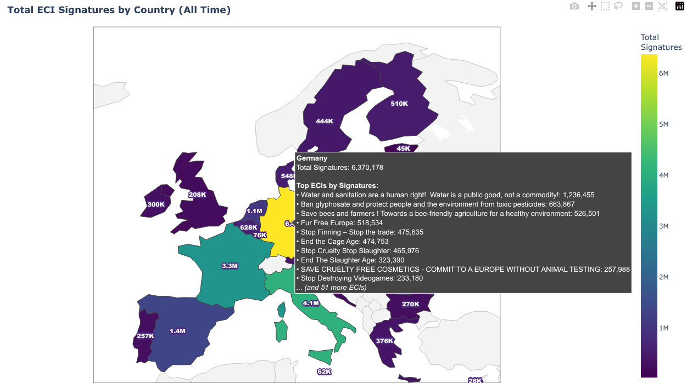
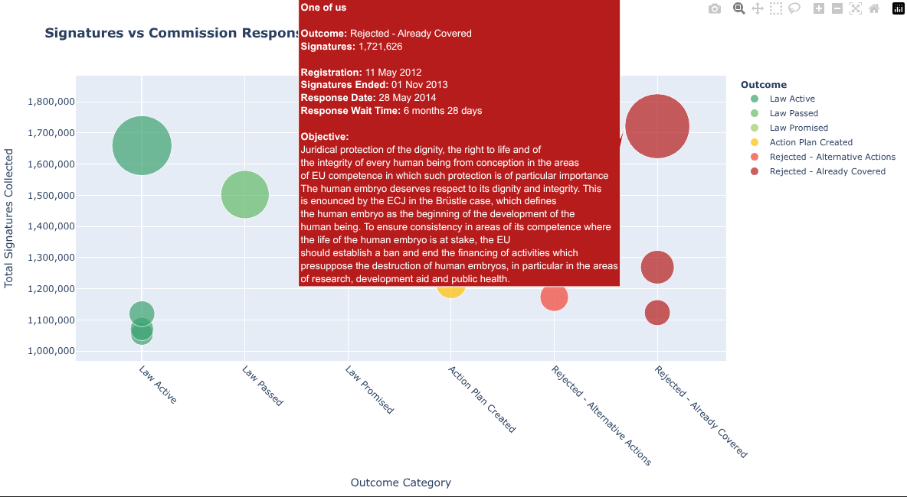

# 🇪🇺✍️ EU Citizens Initiatives Tracker

<div align="center">
  
</div>

<p style="text-align:center;">
  <i>Source: European Citizens' Initiative | European Commission (CC BY 4.0)</i>
</p>

End-to-end data pipeline and analysis project to answer a question:<br>
**"Do citizens' initiatives actually lead to new EU laws?"**

This project scrapes, processes, and analyzes the full lifecycle of ECIs, from signature collection to legislative outcomes. So you can actually see how the petition process works (and where it breaks).

## Data Visualization

A few charts showing what the data looks like:

<div align="center">
  
</div>
<div align="center">
  
</div>

## Data pipeline

The pipeline automates the extraction of unstructured web data into a clean, analytical dataset.

1.  **Scraping**: Selenium bots navigate the EU Registry, Commission answer pages, and follow-up websites to download raw HTML.
2.  **Extraction**: BeautifulSoup parsers process the HTML to extract structured metadata (signatures, dates, legal acts).
3.  **Merging**: Disparate data sources are unified into a single "Accountability Record" (CSV) that links initiatives to their legal outcomes.
4.  **Analysis**: Jupyter notebooks uses the clean data to generate metrics and visualizations.

## Requirements

The project relies on a few key technologies:

-   **Python 3.11+**
-   **Docker & Docker Compose** (for orchestration)
-   **uv** (recommended for fast Python package management)
-   **Selenium** (via webdriver) & **BeautifulSoup4** (Parsing)
-   **Pandas, Plotly, Matplotlib**, etc. (Analysis & Visualization)

## Installation

Clone the repository and set up the environment:

```bash
git clone https://github.com/Luk-kar/eu-citizens-initiatives-tracker
cd eci-tracker
```

### 1. Python Environment (Local)

Use `uv` or `pip` to install dependencies for the data pipeline:

```bash
# Using uv (Recommended)
uv venv
source .venv/bin/activate
uv pip install -r ECI_initiatives/data_pipeline/requirements.prod.txt
```

### 2. Analysis Environment

If you plan to run notebooks locally, create separate environments for each analysis module to avoid dependency conflicts:

**For Campaigns Analysis:**
```bash
# Create and activate a fresh environment
uv venv .venv_campaigns
source .venv_campaigns/bin/activate

# Install dependencies
uv pip install -r ECI_initiatives/exploratory_data_analysis/initiatives_campaigns/requirements.prod.txt
```

**For Responses Analysis:**
```bash
# Create and activate a fresh environment
uv venv .venv_responses
source .venv_responses/bin/activate

# Install dependencies
uv pip install -r ECI_initiatives/exploratory_data_analysis/initiatives_responses/requirements.prod.txt
```

## Usage

You can run the project components individually (standalone) or as a scheduled service (orchestrated).

### Service Deployment (Airflow)

To run the full pipeline on a schedule with a monitoring UI, use Docker Compose:

```bash
# Start the orchestrator services
docker-compose up -d
```

-   **UI**: [http://localhost:8080](http://localhost:8080) (User/Pass: `airflow` / `airflow`)
-   **DAGs**:
    -   `eci_data_pipeline`: Runs scraping and merging (Monthly).
    -   `eci_analysis_notebooks`: Updates analysis notebooks (Triggered 1h after pipeline).

### Standalone run (Manual)

To manually execute pipeline stages without Docker:

```bash
# 1. Scrape Registry
python -m data_pipeline.scraper.initiatives

# 2. Extract Data
python -m data_pipeline.extractor.initiatives

# 3. Scrape & Extract Responses
python -m data_pipeline.scraper.responses
python -m data_pipeline.extractor.responses

# 4. Merge Data
python -m data_pipeline.csv_merger.responses
```

*Note: Ensure you are in the `ECI_initiatives` directory and your virtual environment is active.*

## Project Structure

```bash
.
├── docker-compose.yaml         # Airflow service definition
├── ECI_initiatives/            # Main project source
│   ├── data/                   # Storage for raw HTML & CSVs
│   ├── data_pipeline/          # Scrapers, Extractors, Mergers
│   ├── exploratory_data_analysis/ # Jupyter Notebooks
│   └── tests/                  # Pytest suite
├── orchestrator/               # Airflow DAGs and config
└── read_files_and_content.sh   # Utility script
```

### Most important libraries

-   **[`selenium`](https://selenium-python.readthedocs.io/)**: Browser automation for dynamic EU websites.
-   **[`beautifulsoup4`](https://www.crummy.com/software/BeautifulSoup/bs4/doc/)**: HTML parsing and data extraction.
-   **[`pandas`](https://pandas.pydata.org/docs/)**: Data manipulation and CSV merging.
-   **[`plotly`](https://plotly.com/python/)** / **[`matplotlib`](https://matplotlib.org/stable/users/index.html)**: Interactive and static charts.
-   **[`pytest`](https://docs.pytest.org/en/stable/)**: Testing framework.

### Pipeline Elements Breakdown

| Component | Directory | Description |
| :--- | :--- | :--- |
| **Scraper** | `data_pipeline/scraper` | Downloads pages for Initiatives, Responses, and Follow-ups. |
| **Extractor** | `data_pipeline/extractor` | Parses HTML into raw CSV datasets. |
| **Merger** | `data_pipeline/csv_merger` | Joins signatures, dates, and legal acts into one master file. |
| **Orchestrator** | `orchestrator/airflow` | Manages the schedule and dependencies between tasks. |

## Configuration

-   **Environment Variables**: Configured via [`.env`](.env) (if applicable) or **[`docker-compose.yaml`](./docker-compose.yaml)**.
-   **Dependencies**:
    -   `ECI_initiatives/data_pipeline/requirements.prod.txt`: Core pipeline libs.
    -   `ECI_initiatives/exploratory_data_analysis/*/requirements.prod.txt`: Analysis libs.

## Testing

The project uses `pytest` for unit and integration testing.

```bash
cd ECI_initiatives/tests

# 1. Setup Test Environment (if not already done)
uv venv .venv_tests
source .venv_tests/bin/activate
uv pip install -r requirements.test.txt

# 2. Run Tests
# Run all tests
python run_tests.py

# Run specific suites
python run_tests.py --scraper
python run_tests.py --extractor
python run_tests.py --merger
```
## Maintenance & Future Development

This project is designed for local execution with low computational overhead, utilizing regex-based extraction and manual pre-computation for stability. However, as the dataset grows, several architectural improvements—such as NLP-based classification, database integration (PostgreSQL), and a public-facing Dash dashboard would be nice.

For a detailed breakdown, please see the [Developer Documentation](doc/README.dev.md).

## 📜 License

This project is open-source. Please check the [LICENCE](./LICENCE) file for details.

---

**Note**: This README covers the overall project. For detailed information on specific components or stages, please see the README files in the respective stage directories:
-   [ECI Initiatives & Pipeline Details](ECI_initiatives/README.ECI_initiatives.md)
-   [Airflow Orchestration](orchestrator/airflow/README.airflow.md)
-   [EDA Response Analysis](ECI_initiatives/exploratory_data_analysis/initiatives_responses/README.eda_responses.md)